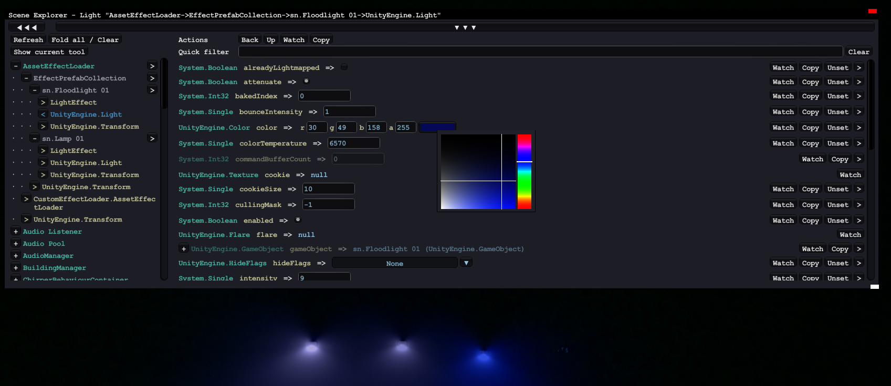
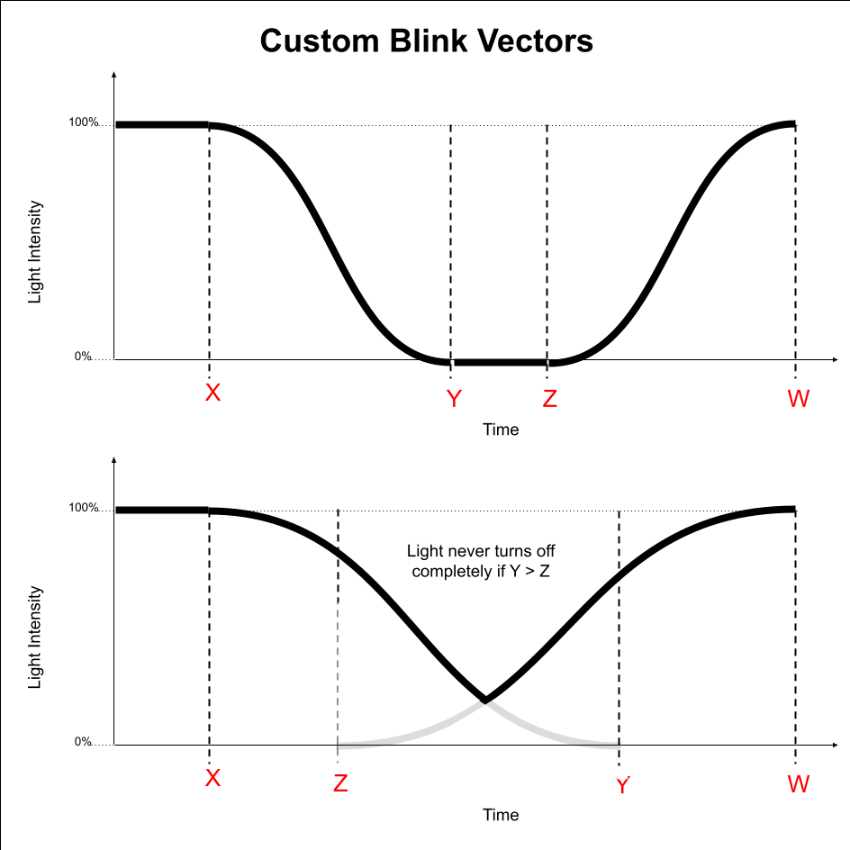
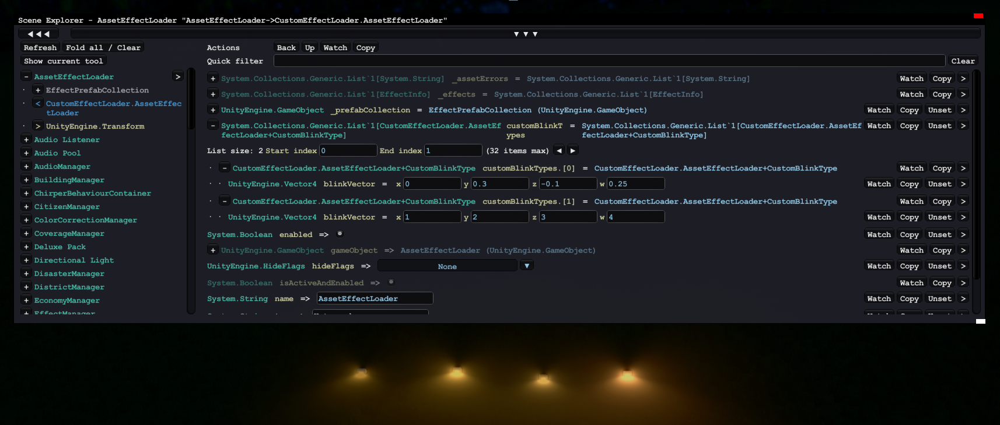

Custom Effect Loader
====================

The mod allows you to define your own **light effects**. Those light effects can be added to props to create all kinds of street lights, lamps and spots. 

Vehicles are also supported, but the asset editor does not provide a UI for adding light effects to a vehicle, so it is a bit more difficult.

In the future, it is also planned to support **particle effects** and possibly **sound effects**.

Vanilla-compatibility
---------------------
The mod stores applied effects in a separate data container that is only loaded when the mod is enabled. That way your assets will still work when the mod is not installed, although without any effects.

Workflow
--------

1. Install and enable the Custom Effect Loader mod
2. Create a new prop in the asset editor. 
3. Save the prop (without any effects) and return to main menu.
4. Navigate to the Assets directory where your prop .crp file is saved.
5. Create a new file `EffectsDefinition.xml` in the directory and insert the following content:

```xml
<?xml version="1.0" encoding="utf-8"?>
<EffectsDefinition xmlns:xsi="http://www.w3.org/2001/XMLSchema-instance" xmlns:xsd="http://www.w3.org/2001/XMLSchema">
  <Effects>
    <LightEffect
      name="boformer.My custom effect"
      type="Spot" 
      intensity="6.2" 
      range="500" 
      spotAngle="20" 
      spotLeaking="0.02"
      batchedLight="true"
      offMin="0.4" 
      offMax="0.7"
      blinkType="None">
      <VariationColors>
        <Color r="255" g="0" b="0" A="255" />
        <Color r="0" g="255" b="0" A="255" />
        <Color r="0" g="0" b="255" A="255" />
      </VariationColors>
    </LightEffect>
  </Effects>
</EffectsDefinition>
```

Now open the asset editor again and load your prop. In the properties panel, expand the "Effects" section and add a new effect. A custom light effect called `boformer.My custom effect` should now appear in the dropdown list.

You can have more than one effect in a single `.xml` file by adding more `<LightEffect>` tags.

Adjusting Your Light Effect
---------------------------

First of all, it's important that your effect names (`name="..."`) are globally unique. That's why I recommend to prefix them with your nickname. That also makes it easier to find them in the effect list. You should not change the effect name after publishing the asset!

Here are a few of the properties that can be adjusted:

Property      | Usage
--------------|------------------------------------------
`type`        | `Spot` / `Directional` / `Point` / `Area`
`intensity`   | Normal street lights have an intensity between 4 and 5. Flood lights have an intensity of 8
`range`       | range of the light effect in m
`spotAngle`   | opening angle of `Spot` lights in deg. Street lights use a big angle of 150deg, but you can also use small angles to create focused spots or even lasers.
`spotLeaking` | light pollution close the source of a `Spot`. Usually in range 0.1-0.5
`batchedLight`| set to `true` to make the light visible from any distance. Set to false for vehicle lights! When set to false, use `fadeStartDistance` and `fadeEndDistance` to control the distance fading.
`fadeStartDistance` | Distance in m where a non-batched light effect starts fading out. Usually around 300.
`fadeEndDistance` | Distance in m where a non-batched light effect becomes completely invisible. Usually around 500. If you want to use a higher value, you need a mod like ULOD to increase the prop render distance.
`offMin` / `offMax` | determine between which daylight levels the lights are turned off (night-only: 0.4/0.7, always on: 1000/1001)
`blinkType` |  `None` / `Blink_050_050` / `MildFade_0125_0125` / `MediumFade_500_500` / `StrongBlaze_0125_0125` / `StrongFade_250_250` / `Blink_025_025` / custom blink vector, e.g. `0.5, 1.0, 1.5, 2.0`
`rotationSpeed` | Non-batched `Spot` lights can be animated. Usual values for this would be between 10 and 50
`rotationAxisX`/`�Y`/`�Z` | Rotation axis vector for the animation.

Inside of the `<VariationColors>` tag, you can add one or multiple `<Color>` tags to define the color variations of the effect. Many vanilla effects use some slight variations for more realism.

A more complex example configuration can be found [here](https://gist.github.com/boformer/6cb54732245b14e214b26fe0b7d1530b)!

Tweaking your light effects with ModTools while the game is running
-------------------------------------------------------------------

It is possible to tweak the blink vectors you have created while the game is running, using ModTools.

Make sure to set `batchedLight="false"` while you are tweaking the light. Otherwise you have to re-place the prop every time to see the changes.

1. Set up your prop and the EffectsDefinition.xml.
2. Start the game and place your prop on the map
3. Open the ModTools scene explorer with CTRL + E
4. Expand AssetEffectLoader > EffectPrefabCollection > [Your Light Effect] in the left sidebar
5. Select either the `LightEffect` or `UnityEngine.Light` and tweak the values (color, intensity, blink type etc.)
6. Once you found the right values, copy them to your EffectsDefinition.xml




Blinking Lights and Custom Blink Vectors
----------------------------------------

To create a blinking light, set `batchedLight="false"` and set `fadeStartDistance` and `fadeEndDistance` (built in effects seem to use `300` and `1000`).

Then set `blinkType` to one of the built in blink types, or create your own blink vector using the format `x, y, z, w`:

```
blinkVector="0.5, 1.0, 1.5, 2.0"
```

The 4 values represent timings when the light starts turning off (`x`), when it is fully turned off (`y`), when it starts turning on (`z`) and when it is fully turned on again (`w`). `w` also determines the duration of the blinking, e.g. setting `w` smaller makes the blinking faster.



It is possible to tweak the blink vectors you have created while the game is running, using ModTools:

1. Set up your prop and the EffectsDefinition.xml
2. Start the game and place your prop on the map
3. Open the ModTools scene explorer with CTRL + E
4. Select AssetEffectLoader > CustomEffectLoader.AssetEffectLoader in the left sidebar
5. Expand the `customBlinkTypes` list and find your blink type.
6. Edit x, y, z, w while the game is unpaused
7. Once you found the right values, copy them to your EffectsDefinition.xml



Workshop Publishing
------------------

The effect and the .crp file should be published as a single workshop item. To do that, go to the Content Manager and click on the Share button of your main building asset.

Click on the little folder icon in the preview image (and edit the preview image if you want), then open the subfolder `Content`. Copy your `EffectsDefinition.xml` into that folder (it should be in the same folder as the .crp file).

List the Custom Effect Loader mod as a dependency of your asset.
